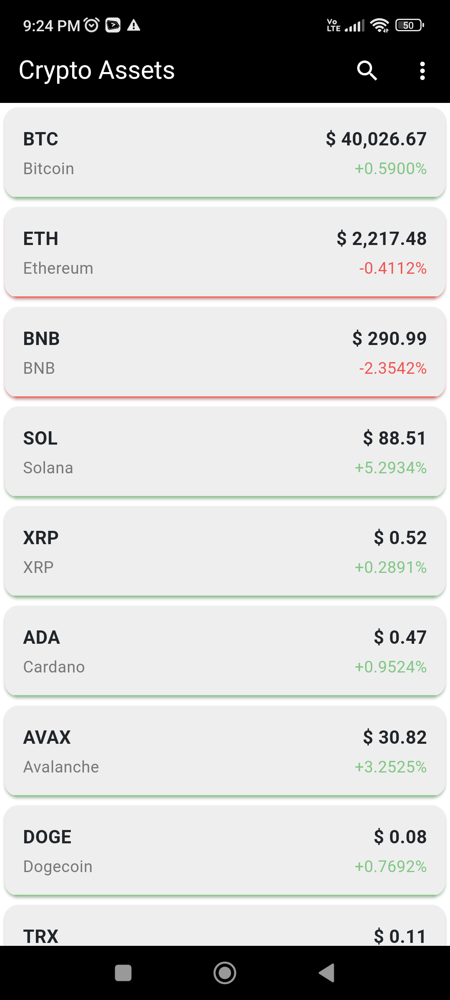
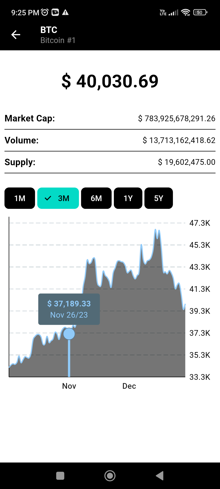

# Real Time Flutter Crypto Charts

Mobile app made with Flutter that displays the prices of cryptocurrency assets in real time by using web-sockets. Users can search for a specific asset (or assets) by symbol. It also displays the details of an asset such as its market cap.

Each asset detail contains a graph reflecting its price across a user-selected time.





## Quick Start

Set Flutter version to 3.16.+

```bash
# Clone the repo
git clone https://github.com/EstebanCardenas/flutter-crypto-charts.git

# Download dependencies
flutter pub get

#Run the app
flutter run
```
